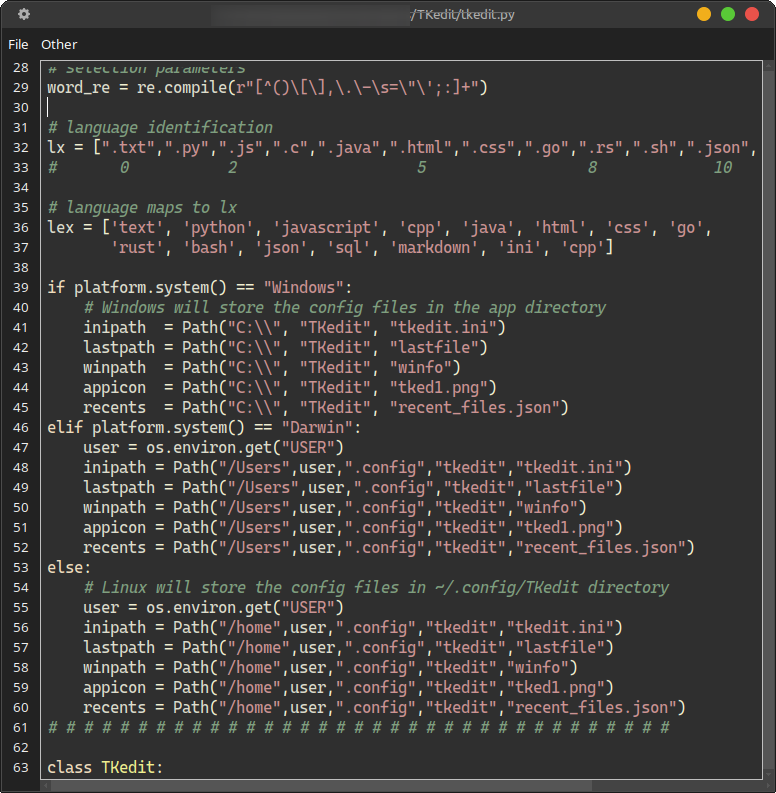

# TKedit: Light Code Editor 2026

### Made with Python, and Ttkbootstrap

> _tkinter_ **Text** is not the _swiftest widget in the class_
but still _packs_ a byte.

## Features           

- Syntax Highlighting (https://github.com/MLeidel/TKsyntex)
- Block tabs
- Language recognition by extention
- Toggle comment lines 
- Bookmarking
- Auto-indentation
- Drag n Drop
- Recent file list
- Open last file on startup
- Toggle word wrap
- Enclose selected ( " ' ` * _ )
- Find and Replace
- Open System Terminal
- Open System File Manager
- Context menu
- Backup file
- Markdown to HTML
- Themes
- For Linux, Windows, Mac

## Configure

File: **`tkedit.ini`**

```config
[Main]
font=Cascadia Code
fontsize=10
lastfile=yes
backup=no
tabsz=4
nospaces=yes
terminal=xfce4-terminal
filemgr=thunar
appath=home/USER/apps/python/projects/TKedit/tkedit.pyc
autoindent=yes
md2html=yes
debounce=100
theme=cyborg
style=material
```

**Config files:**

        lastfile
        recent_files.json
        tked1.png
        tkedit.ini
        winfo

For Windows, these files remain in the app directory (**C:\\TKedit**)  
For Linux and Mac these files are kept in **~/home/_USER_/.config/tkedit**


**some configuration values may differ for Windows.**

            terminal=wt
            appath=C:\\TKedit
            and possibly others

see _win_tkedit.ini_ and _Mac_tkedit.ini_ for examples

### Styles

| Style Name | Description |
|------------|-------------|
| DARK ||
| `material` | Based on Material Design |
| `dracula` | Purple/pink tones popular vampire-themed |
| `zenburn` | Low-contrast easy on the eyes |
| `monokai` | Classic dark theme from Sublime Text |
| `default` | Dark or Light |
| `paraiso-dark` | Paraiso Dark editor-style |
| `solarized-dark` | Popular low-contrast dark theme |
| `native` | Pygments own dark theme |
| `gruvbox-dark` | Retro groove warm colors |
| LIGHT ||
| `default` | Dark or Light |
| `borland` | classic light/bright editor look |
| `bw` | black/white / high readability |
| `tango` | lighter Tango palette  |
| `pastie` | often used as a light-ish palette |
 
### Themes

    Dark
        darkly cyborg superhero solar 

    Light    
        sandstone yeti pulse cosmo flatly litera minty
        lumen journal simplex cerculean

*favorites: cyborg / material and zenburn*
    
## Keyboard Shortcuts

| Special Keys | Description |
|:-----------|:------------|
|-------------------|------------------|
| **Control-n**| New File |
| **Control-Shift-N**|Open File in New Window|
| **Control-o**| Open File|  
| **Control-p**| Open Previous File|
| **Control-Shift-O**|Open Recent File List| 
| **Control-s**| Save File|
| **Control-Shift-S**|Save-As File|
| **Control-q**| Close App |  
| **Control-f**| Find Text |  
| **F3**| Find Next Text |
| **Control-h**| Find - Replace Dialog |  
| **Control-u**| Uppercase|  
| **Control-l**| Lowercase|
| **Control-w**| Toggle Word wrap |  
| **Control-Shift-T**| Open Terminal |
| **Control-Shift-F**| Open File Manager |
| **Control-Slash**| Line Comment |

and others ...

        ctl-End
        ctl-Home
        ctl ->
        ctl <-
        ctl-k
        ctl-a
        shft-End
        shft-Home
        shft-ctl ->
        shft-ctl <-
        shft ->
        shft <-
        shft up-arrow/down-arrow
        shft-ctl up-arrow/down-arrow
        
## Bookmarks

|Keyboard    | Description |
|:-----------|:------------|
|---------------|----------------|
|**Control-Left-Click** | _Toggle_ Bookmark |
|**Control-b** | _Goto_ Next Bookmark |
|**Shift-Control-b** | _Clear_ Bookmarks |


## Python Modules

- Tksyntex
    - source is included
- tklinenums
- ttkbootstrap
- markdown

## Notes

- _Open Previous File_ opens the previous file you had open in the current session  
    whether you saved it or not.  
    Saved files will appear in the "_Recent File List_"
- For markdown docs each Save generates the HTML file with the same base name.
- May need to adjest the "debounce" setting depending on your system.
- Surround selected with " ' \` \_ \*
- `nospace` = _yes_ - will **not** remove trailing spaces for .md files.
- For Windows all of the config files remain in the app directory.
- Leave Tksyntex in your app directory or move it to a python modules directory  
        
        PYTHONPATH=your-python-modules-directory

> 


---


